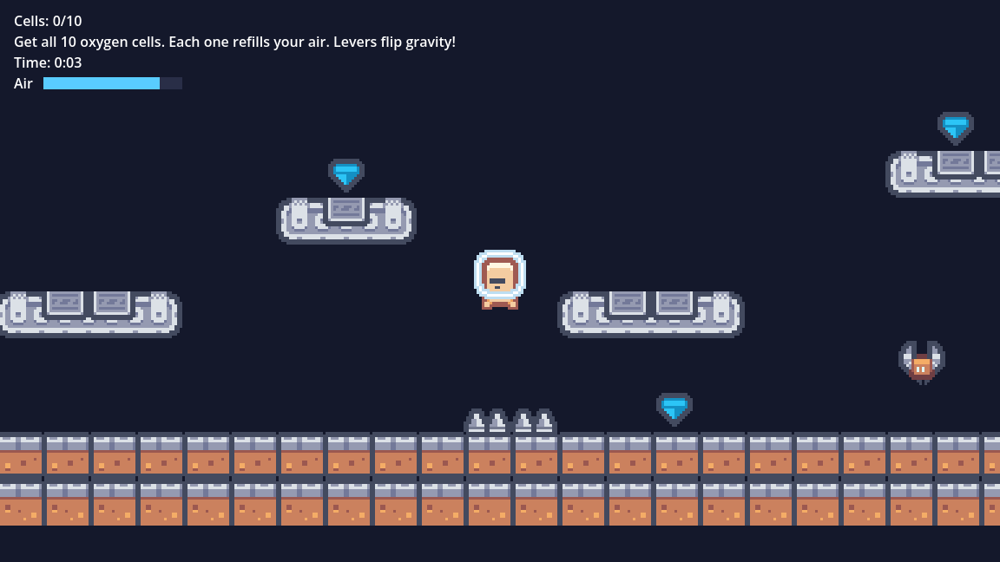
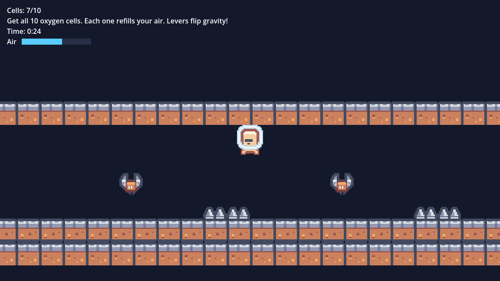
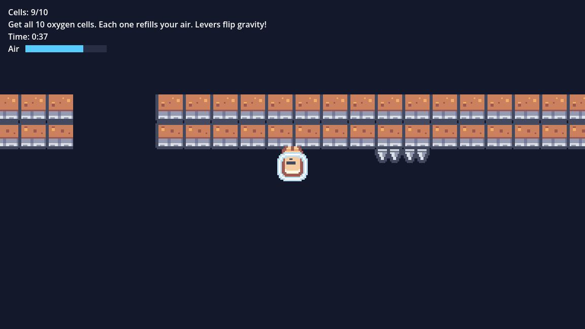

# Airlock

A small low-gravity platformer I made in Godot for Hack Club Jumpstart.

You're stuck on a broken moon base and the airlock is sealed. Grab all 10 oxygen
cells to open it and get out.

- Your suit is leaking, so your air keeps going down. Cells fill it back up.
- Some of the first cells are duds. They zap you and take air instead.
- Near the end there are levers that flip gravity, so you run on the ceiling.
- Drones, spikes, a moving platform and a jump pad are in the way.
- There's a timer if you want to beat your time.

| | |
|---|---|
|  |  |

## Controls

- Move: arrow keys or A / D
- Jump: Space, W or Up (press again in the air to double jump)
- Walk into a lever to flip gravity

## Credits

Made with Godot 4.7. Art and sounds are from [Kenney](https://kenney.nl) (CC0):
[Pixel Platformer](https://kenney.nl/assets/pixel-platformer),
[Industrial Expansion](https://kenney.nl/assets/pixel-platformer-industrial-expansion),
[Digital Audio](https://kenney.nl/assets/digital-audio) and
[Sci-Fi Sounds](https://kenney.nl/assets/sci-fi-sounds).
